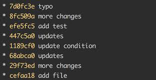
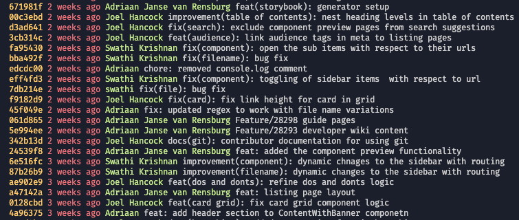
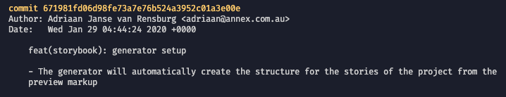
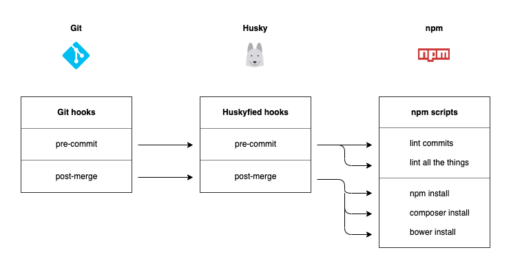

[Let's get to the juice!](#thejiuce)

# Working on this repo

Setup.

```sh
npm install
```

then

```sh
npm run post-install
```

# Playing in the sandboxes

Setup Docker environments.

```sh
ahoy up
```

Jump into the Docker container.

```sh
ahoy bash
```

Read .ahoy.yml for the rest.

---

# Conventional Commits<span id="thejuice"></span>

This is a very brief explanation of the Conventional Commits standard and how to use it in your git projects.

- [TLDR](#tldr)
- What is Conventional Commits?
- Why use it?
- How to use Conventional Commits in a project
- Food for thought
- Resources

---

## What is Conventional Commits?

[Conventional Commits](https://www.conventionalcommits.org/en/v1.0.0/) is a specification to help you write meaningful, standardised commit messages.

> The Conventional Commits specification is a lightweight convention on top of commit messages. It provides an easy set of rules for creating an explicit commit history; which makes it easier to write automated tools on top of. This convention dovetails with SemVer, by describing the features, fixes, and breaking changes made in commit messages.

_From the [Conventional Commits](https://www.conventionalcommits.org/en/v1.0.0/) homepage._

> Project that uses this convention: Angular, Vue.js, Gatsby (almost), Lerna (almost), jest (almost).

_From [Enhance your git log with conventional commits](https://dev.to/maxpou/enhance-your-git-log-with-conventional-commits-3ea4) by Maxence Poutord_

The commit message should be structured as follows:

```sh
<type>[optional scope]: <description>

[optional body]

[optional footer(s)]
```

Example

```
feat(search): add global search to navbar

Add a global website search UI to the website navbar for both desktop and mobile devices.

82749
```

## Why use it?

We've all seen this kind of thing, or worse.



The Conventional Commits format makes commit history more comprehensible.



And it makes commit message detail more informative.



With the consistant formatting comes the opportunity to automate change logs and other artifacts derived from the commit history.

## How to use Conventional Commits in a project

There are lots of ways to use the Conventional Commits standard in a project.

### Tools

| Tool           | Description                                      |
| :------------- | :----------------------------------------------- |
| CommitLint     | For checking commit message format.              |
| Husky          | For automatic commit linting on commit.          |
| Commitizen CLI | A CLI for crafting CC compliant commit messages. |
| Git alias      | A git alias for easy Commitizen CLI access.      |

### CommitLint

[CommitLint](https://github.com/conventional-changelog/commitlint#get-started--lets-chat---website) is a tooling package which checks git commit messages to ensure that they confirm to the Conventional Commits standard.

Install the packages.

```sh
npm install --save-dev @commitlint/{config-conventional,cli}
```

Create the recommended CommitLint config file.

```sh
echo "module.exports = {extends: ['@commitlint/config-conventional']}" > commitlint.config.js
```

### Commit linting with Husky

[Husky](https://github.com/typicode/husky#husky) is an npm package that facilitates the adding of git hooks to a codebase.



With the addition of the [commitlint](https://github.com/conventional-changelog/commitlint#what-is-commitlint) npm package, Husky can help enforce the Conventional Commits format for commit messages of collaborators.

Install thusly:

```sh
npm install husky --save-dev
```

Git hooks can then be added to package.json under the Husky hooks section.

```sh
// package.json
{
  "husky": {
    "hooks": {
      "pre-commit": "npm run ...",
      "pre-push": "npm run ...",
    }
  }
}
```

Next, add a pre-commit hook to Husky in package.json to call the lint commit script.

```sh
// package.json
{
  "husky": {
    "hooks": {
      "commit-msg": "commitlint -E HUSKY_GIT_PARAMS"
    }
  }
}
```

### Commitizen CLI

Install the Commitizen CLI tool for crafting commit messages.

```sh
npm install --save-dev commitizen
```

Add the commitizen adapter.

```sh
./node_modules/.bin/commitizen init cz-conventional-changelog --save-dev --save-exact
```

This opens the CLI when we call this script.

```sh
./node_modules/.bin/git-cz
```

### Git alias

To make the experience a bit nicer we'll create a git alias `git cz` which will open the CLI.

Create a file called `.gitalias` with this content.

```sh
// .gitalias
[alias]
   cz = !sh -c \"./node_modules/.bin/git-cz\"
```

Tell git to recognise this local aliases file to read aliases from.

```sh
git config include.path '../.gitalias'
```

In a real repo we would add a `postinstall` script to `package.json` to add this git config automatically.

```sh
// package.json
{
  ...
  "scripts": {
    ...
    "postinstall": "git config include.path '../.gitalias'",
  }
}
```

## Food for thought

In the examples we've worked through we're using husky to do things based on git events (hooks).

Our huskyfied git hooks are part of our codebase.

This can help with our developer experience and support our quality goals.

We can do automatic `npm` or `composer` package updates after git merges.

```sh
// package.json
{
    ...
    "scripts": {
        "git-post-merge": "./scripts/git-post-merge.sh",
    },
    "husky": {
        "hooks": {
            ...
            "postmerge": "npm run git-post-merge",
        }
    }
}
```

We can run git hooks in our CI pipelines.

## Resources

| Resource | URL |
| :-- | :-- |
| Conventional&nbsp;Commits | https://www.conventionalcommits.org/en/v1.0.0/ |
| CommitLint | https://github.com/conventional-changelog/commitlint#get-started--lets-chat---website |
| Commitizen CLI | https://github.com/commitizen/cz-cli#commitizen-for-contributors |
| Husky | https://github.com/typicode/husky#husky |
| LOLCommits | https://github.com/lolcommits/lolcommits#lolcommits |

---

## Too long? Don't read<span id="tldr"></span>

```sh
npm install --save-dev @commitlint/{config-conventional,cli}
```

```sh
echo "module.exports = {extends: ['@commitlint/config-conventional']}" > commitlint.config.js
```

```sh
npm install husky --save-dev
```

Add a `commit-msg` hook under `husky` config in `package.json`.

```sh
// package.json
{
  ...
  "husky": {
    "hooks": {
      "commit-msg": "commitlint -E HUSKY_GIT_PARAMS"
    }
  }
}
```

```sh
npm install --save-dev commitizen
```

```sh
./node_modules/.bin/commitizen init cz-conventional-changelog --save-dev --save-exact
```

Create a file called `.gitalias` with this content.

```sh
// .gitalias
[alias]
   cz = !sh -c \"./node_modules/.bin/git-cz\"
```

Add a `postinstall` hook and script to `package.json`.

```sh
// package.json
{
  ...
  "postinstall": "npm run post-install",
  "scripts": {
    ...
    "post-install": "git config include.path '../.gitalias'",
  }
}
```

Run the `post-install` script.

```sh
npm run post-install
```
